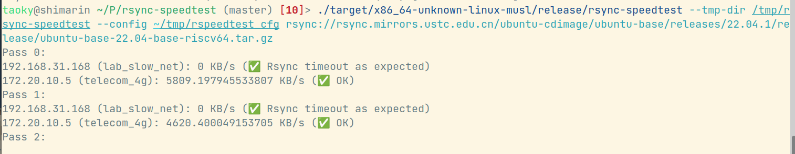

# admirror-speedtest

(Old name: rsync-speedtest)

A simple speedtest program for multiple-IPs (ISP) environment, to optimize the speed of syncing from upstream. **Supports rsync, curl, wget and git**.

PS: There's a racing bug in rsync that prevents proper termination of rsync processes, and it has been workarounded in rsync-speedtest. See comments of [`kill_children()` in main.rs](src/main.rs) for details.

## Args

```
$ ./admirror-speedtest --help
admirror-speedtest 0.3.3
Test speed (bandwidth) of different bind IP to rsync, http(s) and git upstream. Alleviate mirror
site admin's trouble choosing fastest bind IP.

USAGE:
    admirror-speedtest [OPTIONS] <UPSTREAM>

ARGS:
    <UPSTREAM>    Upstream path. Will be given to specified program

OPTIONS:
    -c, --config <CONFIG>      Config file (IP list) path. Default to ~/.admirror-speedtest or (if
                               not exist) ~/.rsync-speedtest
    -h, --help                 Print help information
        --log <LOG>            Log file. Default to /dev/null
    -p, --pass <PASS>          Passes number [default: 3]
        --program <PROGRAM>    Program to use. It will try to detect by default (here curl will be
                               used default for http(s)) [possible values: rsync, wget, curl, git]
    -t, --timeout <TIMEOUT>    Timeout (seconds) [default: 30]
        --tmp-dir <TMP_DIR>    Tmp file path. Default to env::temp_dir() (/tmp in Linux system)
    -V, --version              Print version information
```

### Git support

`libbinder.so` will be searched by this order:

- Same path as admirror-speedtest executable
- `deps` directory in admirror-speedtest executable's parent directory
- Current working directory

Note that libbinder is now seperated to another repo: <https://github.com/taoky/libbinder>, with glibc & musl support.

It throws error and git support will not be available if `libbinder.so` is not found.

## Config file format

```
114.5.1.4 example_ip_1
2001:19:19:8::10 example_ip_2
```

## Screenshot


